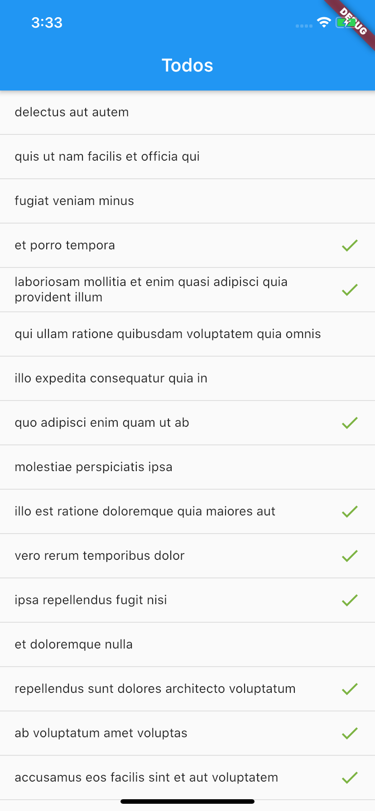

# example

Simple todo list app.

## Getting Started

1. Make sure you check the `environment.yaml` file is correct. Check whether you want remote devtools to be enabled and where you want them to connect.
2. Launch the app in your simulator or device of choice.
3. Hopefully, see how nice this stuff is :)

The app loads all todos from the [`json placeholder api`](https://jsonplaceholder.typicode.com) and lists them. You can tap on todos that have not been completed yet to complete them locally. You can check out the thunk I used to load the list, the synchronous action I use to complete todos, the reducers for both the list and the application status and my store setup. There are also some selectors and functional widgets made with [`functional_widget`](https://github.com/rrousselGit/functional_widget).
